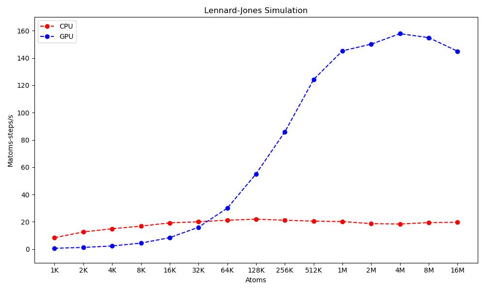
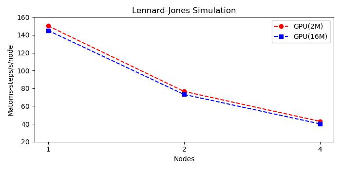
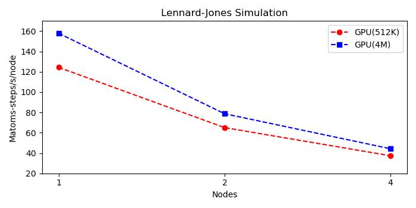

# Description
### The following graphics show the performance of an atomic simulation based on Lennard-Jones potential, using LAMMPS package.  
### This benchmark takes as reference the document:

[LAMMPS - a flexible simulation tool for particle-based materials modeling at the atomic, meso, and continuum scales](https://www.sciencedirect.com/science/article/pii/S0010465521002836)

### A complete reference of test (slurm files) can be found

[Here](lj/)

### "cHARISMa" HPC cluster characteristics are listed in the next table:

|   Device  |   Description   |
|   ----    |   ------  |
|   Node Type   |   Type B    |
|   Processor   |   Intel Xeon Gold 6152 2.1-3.7 GHz (22 cores)    |
|   GPU         |   NVIDIA Tesla V100 32 GB |
|   RAM         |   1536 GB |

---

### For the first graphic, we compare performace with cpu only, and one cpu with one gpu with 16 MPI tasks/node.

### Table with data shown on previous graphic.

|   Atoms   |   Matoms-steps/s CPU  |   Matoms-steps/s GPU  |
|   ----    |   ------  |   ------  |
|   1000    |8.39729271282938   |   0.590622102260311   |
|   2000    |12.5598949992778   |   1.21785620771755    |
|   4000    |14.9151328938341   |   2.29920734826669    |
|   8000    |16.8214591354191   |   4.38495521864483    |
|   16000   |19.2213433796888   |   8.38847004791914    |
|   32000   |20.0576657891438   |   16.0133711649227    |
|   64000   |21.1500330469266   |   29.991892816473 |
|   128000  |21.9537838547071   |   55.1227557932724    |
|   256000  |21.1493341264334   |   85.9195913449437    |
|   512000  |20.4765599379304   |   124.330388581031    |
|   1024000 |20.1925390145883   |   145.280580214317    |
|   2048000 |18.6605922551253   |   150.198382140474    |
|   4096000 |18.3676306384276   |   157.880333183008    |
|   8192000 |19.4168774191102   |   154.953421289072    |
|   16384000    |19.6448248284495   |   145.011683070169    |

---

### Second graph shows strong-scaling with 2M(million) and 16M atoms, on one GPU/node.

### Table with data shown on previous graphic.

|   Nodes   |   2M  |   16M |
|   1   |   150.198382140474    |   145.011683070169    |
|   2   |   76.5035487485992    |   73.1187018574221 |
|   4   |   42.8616873440823    |   40.0199318019717 |

---

### The third graph shows weak-scaling with 512K(thousand) and 4M atoms, on one GPU/node.

### Table with data shown on previous graphic.

|   Nodes   |   2M  |   16M |
|   1   |   124.330388581031    |   157.880333183008    |
|   2   |   65.047260900498    |   78.7029386785746 |
|   4   |   37.3525231921233   |   44.2410966953111 |

